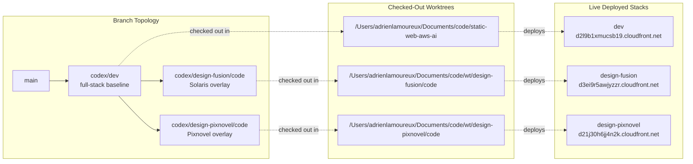

# Branches And Worktrees Diagram

As of 2026-03-19, this is the active Git/worktree topology used for current development.

## Mermaid Diagram

## Notes
- A branch is history; a worktree is a filesystem checkout.
- All worktrees share the same Git object database.
- Each worktree has one active branch and independent uncommitted changes.
- `codex/dev` owns backend, CDK, shared docs, and contract changes.
- The checked-out UI worktrees are frontend overlays that should keep their changes branch-local.
