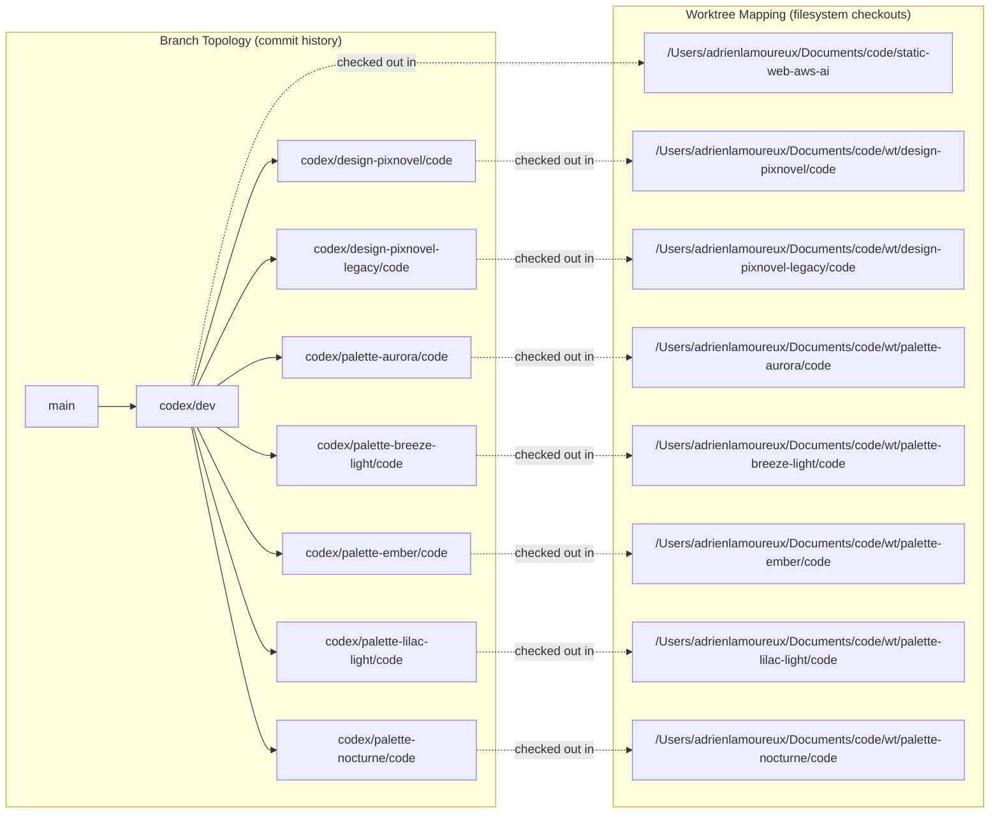

# Branches And Worktrees Diagram

As of 2026-03-15, this is the active Git/worktree topology used for parallel idea development.

## Mermaid Diagram

## How To Read It

- A branch is history; a worktree is a folder checkout.
- All worktrees share the same `.git` object database.
- Each worktree has one active branch and independent uncommitted changes.
- Promote changes between branches with merge/rebase/cherry-pick.
